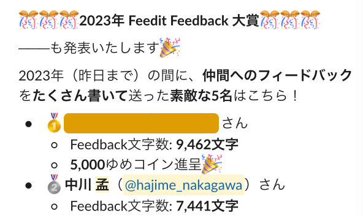

  <h1>feedit-feedbackの哲学</h1>
  
中川孟

# feedit-feedback の哲学

## はじめに

はじめまして。株式会社ゆめみ 23 卒、チャレンジ取締役の中川孟です。

突然ですが、弊社には feedit-feedback というフィードバックのための社内ツールがあります。Slack コマンドになっており、Slack 内のメンバーを宛先としてひとりメンションしてその後にメッセージを書いて送信することで、feedit アプリ経由でフィードバックが贈られる仕組みです。

圧倒的な成長環境を謳っている弊社[^1]では、フィードバックを通じた同僚への成長支援が推奨されており、feedit-feedback も利用を推進されています。フィードバック一般についてのガイドラインも存在するくらいです（参考文献 1）。

一方で、feedit-feedback が使われる頻度は、実はそこまで高くありません。最近でこそ気軽に使われ始めた印象がありますが、1 日に 1 度も使われない日もありますし、平均して 1 日に数回程度です。これは、同様の仕組みである feedit-thanks コマンド（その名のとおり感謝を伝えるためのコマンド）が 1 日に数十から数百の単位で利用されていることを考えると、とても利用が盛んとはいえません。

実際にメンバーの声を聞いてみると「面倒、大変、うまく書く自信がない、ブーメランが怖い」などといったなかなかネガティブな反応が観測されます。feedit-feedback は使われにくいのです。

しかしその中でも私は、この feedit-feedback コマンドをかなり利用しているメンバーのひとりです。最近、利用推進のための取り組みとして、一定期間内に feedit-feedback コマンドを利用した回数の多い人にポイントが当たるキャンペーンが行われているのですが、私はそこで 1 位になりました。

また別の時期のキャンペーンで、feedit-feedback の文字数部門でも好成績を収めた経験があります。

同僚からも「フィードバックがうまいね」なんてフィードバックをもらうくらいで、社内でも有数の feedit-feedback 活用上手だと自負しています（とはいえ、伸びしろは大きいと考えていますが）。

というような背景もあり、私は feedit-feedback の活用を推進していきたいと考えています。今回は、本格的に推進に取り掛かる前の自分の整理として、私自身が feedit-feedback に対してどのようなメンタルモデルを持っているのかを書いてみることにします。「feedit-feedback の哲学」なんてかっこつけたタイトルを付けましたが、「feedit-feedback に対する見方を考えてみよう」くらいの意味で受け取ってください。

私には、「同僚に対して積極的にフィードバックをしよう」という心構えがあります。たしかにフィードバックは「面倒、大変、うまく書く自信がない、ブーメランが怖い」。これは私にとっても同じです。しかし、**だからこそやる意味がある**。私はそう考えているのです。そしてこの理由は、feedit-feedback に対する私の見方を紐解くことで、きっとあなたにも理解してもらえるはず。そう考えて、今回筆を執ることにしました。

この文章はゆめみのメンバーの方はもちろん、ゆめみ以外でピアボーナスの仕組みを導入している、あるいはこれから導入したいと考えているみなさまのお役にもきっと立つはずです。

## feedit-feedback の特徴

まずは簡単に、feedit-feedback の特徴を確認します。

feedit-feedback は、フィードバック一般の中でも、「Slack 上で」「テキストで」贈られるフィードバックであり、ツールの制約上贈り手と受け取り手が 1 対 1（人対人）となります。また、「給与プロリク」と呼ばれる、給与自己決定制度[^2]を利用する際の一定の手続きを契機に、その人が直近でお世話になっている人から、その人の普段の仕事ぶりに対して「Expect/Good/Next」の形式で贈られることが多いです。「Expect/Good/Next」はそれぞれ「期待/褒め/機会点」です。

ちなみに、フィードバックガイドラインでは「Expect/Good/Next のいずれかのフィードバックを行うフィードバック」を「EGN フィードバック」と名付けています。先の説明を言い換えると、「給与プロリクの提出をきっかけに、普段の仕事ぶりに対して EGN フィードバックを贈るために、feedit-feedback を使うことが多い」ということになります。

## feedit-feedback は「重い」？

feedit-feedback の利用に後ろ向きな声のひとつに「feedit-feedback は重い」というものがあります。「重い」というのはおそらく「腰が重い」と似たような意味合いで、「気軽にはできない」というようなニュアンスかと思います。

こうなってしまうのにはおそらく、feedit-feedback が給与プロリクへのフィードバックを中心に使われていることが起因しています。給与プロリクへのフィードバックは半年から 1 年分のフィードバックをまとめてするようなもので、EGN をしっかり書く傾向にありますから、（feedit-thanks など、日常的なフィードバックと比較して）文字数が多くて重厚なフィードバックになりがちです。だから「重い」。そんな力の入った文章はなかなか書けないよ、ということなのです。

しかし、よくよく考えてみるとこれはおかしな話です。たしかに、feedit-feedback でのフィードバックは統計的には重いフィードバックになる「傾向」がある。しかしそれは決して「制限」ではありません。重いと感じるのであれば、もっとライトなフィードバックをしてもいいはずなのです。実際、ゆめみ代表のあほっちも「ひとことフィードバックをどんどんしてください」と軽めのフィードバック数を増やしていくことを推奨しています。それなのになぜか、メンバーには「長文で書かなきゃいけない」という意識が残っている。

この背景には、**「feedit-feedback は長文で書くべき」という規範が存在している**のだと、私は考えています。私たちは、重厚感のあるフィードバックを善としている。

## 贈与としてのフィードバック

この規範について考えていくために、「フィードバックは贈与の一種である」という見方を導入します。

「贈与」とは「交換」と対になる概念で、ここでは簡単に「その場で相手に対価を強制せずに、何かを差し出す行為の中でも、特に相手のためを想って行われるもの」と定義します。フィードバックガイドラインで推奨されているようなフィードバックは、「その場で相手に代金や返礼を強制せずに、相手の成長を想って文章を書く（ための時間や労力を差し出す）」という点で、贈与性を帯びているといえます。

さて、ひとくちに贈与と言っても、もらって嬉しいものとそうでないものがありますね。それはフィードバックも同じです。もらって嬉しいフィードバックと、そうでないフィードバックがある。贈与の定義上、フィードバックは「相手のためを想って」書くものですから、贈り手としては自分のフィードバックによって受け取り手に喜んで欲しいことになります。では、フィードバックの「贈与としての価値」を高めるためには一体どうしたらよいのでしょうか？

## 贈与の「わざわざ度」

まずひとつ、鍵になるのが「わざわざ度」という尺度です。

私たちがある贈与に対して並々ならぬ贈与性を感じるのは、「受け取り手のためにわざわざ用意した」という「わざわざ性」に起因します。この「わざわざ性」が大きければ大きいほど、贈与としての意味合いが大きくなります。

たとえば、知人から大好きなアーティストのコンサートチケットをもらうことを想像してください。もちろん、それ自体はとても嬉しいことです。コンサートは 1 年に数回しか行われませんし、チケットの数は限られています。これを欲しがる人は他にもいるはずです。そこであなたはきっと気になることでしょう。

「どうして私にくれるんですか？」

相手は答えます。

「さっき商店街の抽選会でたまたま当たったんだよ。このアーティストよく知らないし、その日もう予定入ってるし。で、たまたま君に会ったから」

なるほど、それは「ラッキー」だ。

ここで、このチケットを手に入れた嬉しさは、相手からの贈与というよりもむしろ、自分の幸運として解釈されます。そのチケットを必要としない人が最初に出会った「必要としている人」が、たまたま私であったというラッキー。「きっと日頃の行いがいいからだ」などと考えるかもしれません。

しかし、このパターンならどうでしょうか。

「どうして私にくれるんですか？」

「君の喜ぶ顔が見たくてさ。いや〜、抽選倍率が高かったから友達にもめちゃくちゃ協力してもらったよ笑」

えっ、どうして「わざわざ」そんなにも私のために。きっとあなたはそう思うはずです。

ここで、このチケットは「この人がわざわざ私のために用意してくれた贈与」として受け取られます。わざわざ友達を動員してまでプレゼントしてくれたチケット。私の喜ぶ顔を見るために。

「わざわざ」というのは、そこにある不合理の大きさを指しています。「私の喜ぶ顔を見る」というたったそれだけの目的のために、友達を動員してまでチケットを入手してくれた。そんなの、割に合わないじゃないか。この不合理の大きさ、「わざわざ度」に、私たちは並々ならぬ贈与性を感じます。

1 つ目の場合を振り返ってみると、私のもとにチケットが渡ってきたのはある種合理的な理由からでした。相手はこのアーティストをよく知らないし、その日はもう予定が入ってる。だから要らなかった。その理由を知り、私は「なるほど」と反応します。

一方で 2 つ目の場合には、理由を教えてもらった私は「どうして」と反応します。合理的に解釈できないからです。その不合理を、心のこもった「贈与」として受け取ることができるのです。

そして、このメカニズムが「feedit-feedback は長文で書くべきという規範」の根源ではないでしょうか。feedback の贈り手は、なるべく立派な贈与を贈りたいと想っている。となると、「わざわざ度」の高い長文を書きたい。「そうじゃないと贈与にならない」。そういった道徳観が、かえって贈り手の腰を重くしている。そういう構造があると私は考えています。

## 「わざわざ度」の罠

「わざわざ度」が、贈与の意味合いの大きさを決める。

しかしこの「わざわざ度」だけでは、贈与の良し悪しは決まりません。むしろ「わざわざ度」には「罠」があるといっていい。どういうことか。

たとえば 2 つ目の場合で、チケットをくれる人が見ず知らずの人だったらどうでしょうか。初対面の人に「君の喜ぶ顔が見たくて」「めちゃくちゃがんばった」といわれる。「誰ですか」と聞いても正体を明かさない。受け取り手がアイドルか何かで、贈り手がファンだったとかならまだしも、普通は違和感や、ともすれば恐怖心を抱くはずです。そしてチケットを進んで受け取ろうとはしないでしょう。

あるいは、そのチケットが受け取り手にとって欲しいものでなかったらどうでしょうか。「申し訳ないけど、要らないです」と断られる。せっかくの「わざわざ度」が空回りしたことになります。

このように、「わざわざ度」は、贈与として受け取られなかった場合に、悪い意味に転じたり、無に帰したりします。これが「わざわざ度の罠」です。「わざわざ」やれば万事解決というわけではありません。

贈与には受け取られない可能性がある。これが重要な点です。贈り手がどれだけ「わざわざ」用意したものでも、受け取り手が要らんといったら要らんのです。贈与が贈り手の意図とおりに機能するかどうかは、受け取り手が決める。受け取り手が「受け取るかどうか」にかかっているのです。

贈与の良し悪しも同様に受け取り手が規定します。受け取り手の喜びが大きいほどよいということです。

## 受け取りやすさと関係性

さて、ここでもうひとつ考えてみてもらいたい場合があります。それは、1 つ目の場合において「チケットをくれる人」を「知人」から「見ず知らずの人」に変えた場合です。見ず知らずの人が、「さっき商店街の抽選会でたまたま当たったチケット」を、「このアーティストよく知らないし、その日もう予定入ってる」から、「たまたま会った」私にくれる。そんな状況を想像してみてください。

こちらは案外、「受け取ることができる」のではないでしょうか。驚きはするけど、「君の喜ぶ顔が見たくて」ほどの違和感はなく、相変わらず「ラッキー」として捉えられる気がするのです。同じ「チケットをくれる人が見ず知らずの人」という条件でも、1 つ目は受け取りやすく、2 つ目は受け取りづらい。

ここに重要なヒントが隠されています。2 つ目の、わざわざ度の低い方が「受け取りづらい」のはなぜなのか。

それは、わざわざ度は受け取り手にとっては負担だからです。「私のためにわざわざそんなことをさせて、申し訳ない…」そんな「負債感」を受け取り手にもたらすのです。

反対に、1 つ目の方は相手にとっても要らないものだから、受け取るときの負債感を感じにくい。

ただし、ここで注意してもらいたいのは、この場合にはやはり「贈与」としての特別な意味は生じにくいということです。要らないものをもらってあげる。これは合理的な「交換」の関係に近いものです。それはドライで、贈り手と受け取り手が誰であってもおよそ成り立つ。

これと対象的なのは、「チケットが受け取り手にとって欲しいものでない」かつ「わざわざ用意したもの」かつ「受け取り手が受け取った」場合です。チケットが欲しいものではなかったのにもかかわらず、なぜ受け取ったのか。それは、「わざわざ」チケットを用意した贈り手に対して、受け取り手が敬意を払ったからです。モノはイマイチでも、「あなたのその気持ちが嬉しいです」と受け取ってもらえる。負債感を引き受けてもらえる。贈り手にとってこのことは、「受け取ってくれてありがとう」と言いたくなるような、味わい深い享楽になります。これは需要と供給だけで決まる交換の関係性には生じ得ません。

## Good / Next 形式の功罪

贈与としての意味合いは「わざわざ度」に支えられているのに、「わざわざ度」が大きいほど受け取り手にとっては負担になり、受け取られづらい。そして、もし受け取られなかったら「わざわざ度」が裏目に出たり空回りしたりする。この事実に直面したとき、贈り手は「どうやったら受け取ってもらえるだろうか」という問題と向き合うことになります。これはフィードバックでも同様です。

フィードバックを受け取ってもらうための技術が、フィードバックガイドラインに書いてあります。それが Good / Next という形式です。

> **_肯定・感謝・褒めるなどを組み合わせて改善点を指摘すること_**
>
> **_関係性ができ上がっていない相手には事前に肯定・感謝・褒めるを十分に行っておくこと_**

赤く、大きく、そして斜め文字で最大限強調して書かれています。受け取られづらい Next を受け取ってもらうために、先んじて受け取られやすい Good を伝えておくこと。これは確かに、有効な心理的テクニックであるようです。

ただ私は、この Good / Next 形式の取り扱いには少し慎重にならないといけないな、と感じています。

まず第一に、形式的すぎる Good / Next は「建前 / 本音」に見えてしまうという点があります。Next を言いたいがために「わざわざ」Good を書く。受け取り手が Good / Next を「心理テクのひとつ」と理解している場合はなおさら、Good が形骸化して見えてしまいます。このとき、受け取られなかった贈与は、「私をコントロールするために表層的な操作を試みているな」という「悪意」として伝わってしまいかねません。

第二に、そもそも「Next を伝えるためにわざわざ Good を書かなきゃいけない」というのは、信頼性の欠如としても捉えられるということです。ガイドラインにも「関係性が出来上がっていない相手には十分に」という但し書きが書いてありますが、Good を書いて受け取られやすくしたいのはそもそも「受け取ってもらえないかもしれない」という心配からであり、これは関係性や信頼感の問題です。 Next だけでも受け取ってもらえる関係性もあり得るはずなのです。もちろん「関係性を育むために丁寧な EGN フィードバックを積み重ねていく」というのはフィードバックの尤もなあり方かと思いますが、やはり真に配慮すべきは二者間の関係性であり、そこを忘れてはいけません。

「形式」という「表層」に囚われると、贈与的な関係性の本質を危うく見失なってしまう。次の項目ではもう一歩深い部分で「フィードバックを受け取ってもらうためにはどうしたらいいか」を考えてみたいと思います。

## 「わかっている」ということ

ひとつ思い出話をさせてください。私が大学生のときに、当時のガールフレンドに誕生日プレゼントを渡したときのエピソードです。

彼女はとてもかわいらしい女性でしたが、なんというか、洒落っ気があまりなく、コスメやアクセサリーなどにほとんど興味のない人でした。趣味はゲームで、ぼくは彼女と対戦するとどんなゲームでも大抵手が出ませんでした。

ぼくが彼女の誕生日プレゼントに選んだのはゲームソフトでした。相手は大学生の女の子ですから、コスメやアクセサリー、ブランド物などを選んでおくのが王道の戦略かと思うのですが、おそらくこちらのほうが喜ばれるだろうと考えてのチョイスでした。

狙いどおり、彼女はプレゼントを受け取って喜んでくれました。そしてぼくにこう言ったのです。

「わかってるじゃん！」

私の好きなものを、私の欲しいものを、わかっている。この言葉は、安易にネックレスなどを選ばなかった私への褒め言葉であり、ゲームを選んできたことへの称賛です。

そして同時に、「私のこと=私の価値観をわかっている」ということでもあります。

**だから受け取られた**。そう思うのです。

贈り物を受け取るとき、それはなんにせよ受け取り手がそれをほしいと思っているときです。

ではどうして受け取り手の欲しいものが分かるのか。それは、贈り手が受け取り手のことを理解しているから、「受け取り手の価値観をわかっているから」です。

逆にいえば、贈り手が贈り物を受け取ってもらうためには、受け取り手への深い理解が重要になるのです。

私はここが、フィードバックを贈る際にもっとも大切な点だと考えています。

ただ自分が目についたところをいうだけのような、独りよがりなフィードバックになってはならない。

贈り手がいいたいことをいうのではなく、受け取り手のことを理解し、相手が欲しいものを想像するところからはじめる。

だからこそ、受け取ってもらえたことを喜べるのではないでしょうか。

## フィードバックがもたらす精神的成熟

さて、これまでフィードバックを贈ることに関するさまざまな側面について考えてみました。

受け取られる保証はないが、相手のためを想ってわざわざ書く。

その良し悪しは、受け取り手が規定する。

受け取られるために相手が大切にしているものに配慮し、欲しいものを想像する。贈り手がいいたいことをいうために書き始めるのではなく。

受け取ってもらえたこと、受け入れてもらえたことを喜ぶ。

そして、仮に受け取られなかったとしても、それは仕方のないことです。あっけらかんとしておくほかない。

フィードバックを贈ることにはこれだけの大変さがあります。だからこそやる意味があるのです。フィードバックに関するこれらの厳しい条件が、贈り手に精神的成熟をもたらすからです。これが、冒頭で触れたフィードバックに対する私の心構えです。

## 受け取り手の心構え

最後に、フィードバックの受け取り手の心構えについても簡単に触れておきます。

受け取り手の心構えとしてもっとも重要なのは、「フィードバックを受け取ったときに、受け取ったことをきちんと示す」ということです。なぜなら、贈り手にとってはフィードバックを受け取ってもらうことが目的であり、きちんと受け取ってもらえたことが分かると安心できるからです。

受け取ったことを示す方法はいくつかあります。

たとえばフィードバックへのお礼です。「フィードバックありがとうございました。この部分に関して、こういう風に受け取りました」とフィードバックへのフィードバックと併せてもいいでしょう。

フィードバックの内容が「ここをこうしたらよくなると思います！」といったような行動変容を促すものであれば、自らの行動にフィードバックの内容を反映することもまた、フィードバックを受け取ったサインになります。変化したあなたを見て、贈り手は受け取ってもらえたことを実感できます。

こうした、「フィードバックを贈り受け取る」というやり取りを積み重ねることで、関係性を深めていくことができます。

その点でいえば、「どのようなフィードバックを求めているのか」を受け取り手が周囲に伝えることもまた重要な心構えのひとつです。受け取りやすいフィードバックの種類やタイミングは人それぞれです。いまフィードバックを受け取る余裕のある状況なのか、どういうフィードバックならば受け取ることができるのか、受け取り手自ら発信していくことが、フィードバックによる関係性構築の近道になります。

## おわりに

今回は「贈与」という観点で feedit-feedback（あるいはフィードバック一般）について深堀りしてみました。今回は執筆を依頼されたのが急だったので、勢いで筆を執って短い時間で書き上げたのですが、思いの外書けることがたくさんあって自分でもびっくりしています。

実はこの「贈与」についての考え方は、参考文献に付した近内先生のものをほとんど受け売りに近い形で参考にしています。文章を書きながら、「ああ、あれもこれも、あの本の受け売りだなあ」と恥ずかしい気持ちになったのですが（もちろん剽窃はしていないつもりです）、これも贈与のリレーの一形態と考えておきます。この文章をきっかけに、少しでも贈与的な世界観に足を踏み入れる方がいらっしゃれば幸いです。また、ご興味のある方は近内先生の書籍をぜひ一度読んでいただくことをおすすめします。

そしてもちろん、ゆめみのメンバーの皆さまには、この文章をきっかけに feedit-feedback の活用にトライしていただくことを期待しています。フィードバックはやはり難しい。この文章を読んでより難しいと感じられるようになったかもしれません。だからこそ、フィードバックに取り組むことはメンバーに精神的な成熟をもたらすと私は考えています。そして、贈り受け取る関係性の喜びをぜひ体感していただきたいです。

ゆめみ社外の読者の皆さまにおかれましては、社内でのフィードバックの仕方やピアボーナスの設計について弊社でご相談に乗れるかと思います。代表 X[^3] の DM などからいつでもお声がけください。

最後に、今回の文章について公開前に短い時間で入念なフィードバックをくださった皆さまに、この場を借りて改めて感謝申し上げます。ありがとうございました。

## 参考文献

1. 「フィードバックガイドライン」ゆめみオープンハンドブック (https://www.notion.so/5ab770784d644a1b8e15b278ab8da128?pvs=21)（2024/04 アクセス）
2. 近内悠太(2020)『世界は贈与でできている――資本主義の「すき間」を埋める倫理学』NewsPicks 出版
3. 近内悠太(2024)『利他・ケア・傷の倫理学　「私」を生き直すための哲学』晶文社
4. バッキンガム,M., グドール,A.(2019)「フィードバックの誤謬」『DIAMOND ハーバード・ビジネス・レビュー』2019 年 10 月号

[^1]: いい会社すぎて他社に行けない！？圧倒的成長環境を謳うゆめみで働くテックリードに本音を語ってもらった【ゆめみかけの Radio】| https://yumeminonaka.yumemi.co.jp/column/yumemikakeno-radio01 などを参考
[^2]: https://yumemi.notion.site/815649ec12304cd7a58ecd5eaee15789
[^3]: https://twitter.com/raykataoka
